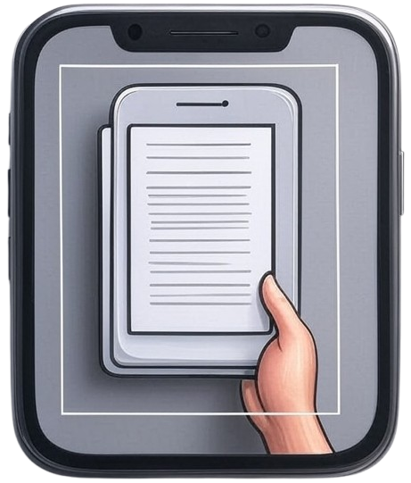

# DocScanner

<p align="center">
  
</p>

DocScanner is a simple and efficient web application for scanning documents using your PC or your phone's camera (via IP Webcam). It offers perspective correction, filtering, cropping, and allows downloading your documents as images or PDFs.

---

## Features

- **Upload from PC** or **capture with your phone** (using IP Webcam apps).
- **Automatic document edge detection** with a yellow outline in the preview (outline visible only in preview).
- **Flatten** (perspective correction) and crop the document.
- **Filters:** Color, grayscale, black and white.
- **Adjustments:** Brightness, contrast, smoothing, rotation.
- **Download:** Save your processed document as a JPG image or PDF.
- **Clean Button:** Easily reset the workflow to scan a new document.
- **Modern and responsive interface** using Bootstrap.

---

## Installation

1. **Clone or download this repository.**
2. Install the required dependencies:
   ```
   pip install -r requirements.txt
   ```
3. Run the application:
   ```
   python app.py
   ```
4. Open your browser and navigate to [http://localhost:5000](http://localhost:5000)

---

## Usage

### Scan from PC

1. Click "Upload photo (PC)" and select an image of your document.
2. A preview will appear with a yellow detection outline.
3. Click "Flatten" to correct the perspective if desired.
4. Apply any filters and adjustments as needed.
5. Choose the output format and click "Process and Download".

### Scan with your phone using IP Webcam

1. Install the [IP Webcam](https://play.google.com/store/apps/details?id=com.pas.webcam) app on your phone.
2. Open the app and start the server.
3. From your PC browser, paste the snapshot URL (e.g., `http://192.168.1.3:8080/shot.jpg`) into the appropriate field and click "Take photo".
4. Continue as with the PC upload workflow.

### Clean to scan another document

- Click the **Clean** button to reset the workflow and upload a new image or URL.

---

## File Structure

- `app.py` – Main application logic (Flask + OpenCV)
- `templates/index.html` – Main user interface
- `static/styles.css` – Custom styles
- `static/logo.png` – **Place the provided logo here**
- `uploads/`, `rectified/`, `filtered/` – Folders for temporary images

---

## Feedback

Comments or suggestions? Your feedback is welcome!